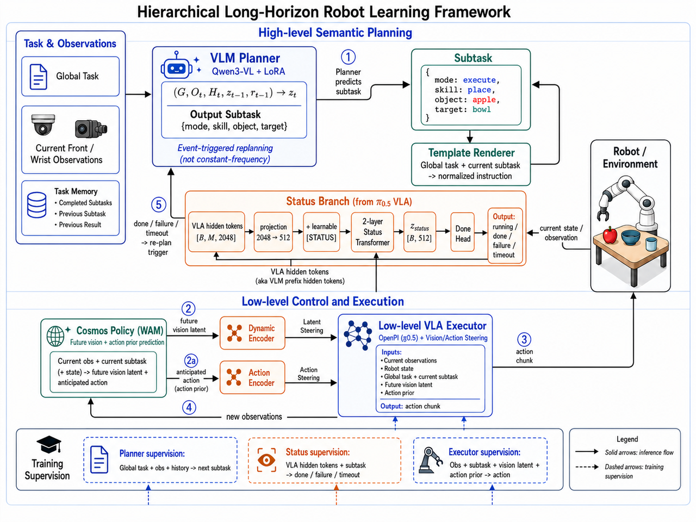

# Long-Horizon OpenPI

这是一个面向长时程机器人操作任务的分层视觉语言控制系统。系统将高层语义规划、子任务完成检测、Cosmos/WAM 世界模型先验和 OpenPI pi0.5 低层动作执行组合在一起。

## 系统架构



### 1. 高层语义规划

Qwen3-VL Planner 接收全局任务、当前前视/腕部相机观测以及已经完成的子任务历史，通过 LoRA 微调输出当前子任务：

```json
{
  "mode": "execute",
  "instruction": "...",
  "atomic_skill": "...",
  "stage": "..."
}
```

Planner 采用事件触发式重规划。子任务完成、失败或超时后，Task Memory 更新，Planner 再生成下一个子任务。Template Renderer 将全局任务和当前子任务转换为稳定的低层 VLA prompt。

### 2. π0.5 Status Branch

Status Branch 从 pi0.5 VLA 的 prefix hidden tokens 读取当前观测和子任务信息，不使用 action expert 的 noisy-action suffix：

```text
VLA prefix [B, M, D_vla]
    -> projection [B, M, 512]
    -> append learnable [STATUS]
    -> 2-layer Transformer
    -> z_status [B, 512]
    -> Done Head
```

输出用于判断当前子任务处于 `running`、`done`、`failure` 或 `timeout` 状态，并触发下一次重规划。Status Branch 可以和 VLA 动作损失联合训练。

### 3. Cosmos/WAM 先验

Cosmos/WAM 作为冻结的外部世界模型，基于当前观测、机器人状态和当前子任务生成：

- future vision latent：描述未来视觉状态；
- anticipated action prior：描述 WAM 预测的动作趋势。

两个先验分别经过 `dynamics_encoder` 和 `action_encoder`，再通过 latent steering 注入 OpenPI pi0.5。推理时默认每次生成一个 action chunk 调用一次 WAM，而不是每个控制 step 重复调用。

### 4. OpenPI pi0.5 执行器

低层 VLA 接收当前图像、机器人状态、全局任务、当前子任务、future vision latent 和 action prior，输出长度为 `K` 的 action chunk。训练时可以使用离线 WAM cache；评估时可以切换为实时 WAM 推理。

## 代码结构

```text
src/openpi/models/                 pi0.5、WAM steering、Status Branch
src/openpi/training/               TrainConfig、数据配置和训练组件
scripts/train.py                   JAX/NNX 训练入口
scripts/                          训练和评估脚本
tools/                             数据检查、转换、统计和验证工具
configs/                           OpenPI 训练配置
docs/                              设计文档和架构图
examples/                          仿真及真实机器人示例
third_party/                       LIBERO、ALOHA 等第三方代码
```

## 环境与数据

模型权重、checkpoint、Cosmos cache、RoboCasa/LIBERO 数据集和视频文件不纳入 Git。请根据具体实验准备本地路径，并使用对应的虚拟环境：

- OpenPI/JAX 训练：项目根目录的 `.venv`；
- Qwen3-VL Planner：`.venv_qwen3vl`；
- Cosmos/WAM cache 提取：Cosmos 项目对应的独立环境。

已有的训练和评估说明：

- [JAX Status Branch 训练说明](README_JAX_STATUS_ROBOCASA.md)
- [Qwen3-VL Planner 训练说明](README_QWEN3VL_PLANNER_TRAIN.md)
- [Cosmos cache 与训练说明](README_COSMOS_PREDICT_CACHE_TRAIN.md)
- [LIBERO WAM 评估说明](README_LIBERO_WAM_EVAL.md)

## 版本控制范围

仓库只保存代码、配置、文档和小型示例。以下内容默认被 `.gitignore` 排除：

- `checkpoints/`
- `datasets/`
- `cosmos_cache/`
- `cosmos_checkpoints/`
- `outputs/`
- `models/`
- `*.pt`、`*.pth`、`*.safetensors`、`*.mp4`、`*.npz`

## License

本项目中的第三方代码和模型权重分别遵循其原始许可证。使用前请确认 OpenPI、pi0.5、Cosmos、LIBERO 和 RoboCasa 的许可条款。
